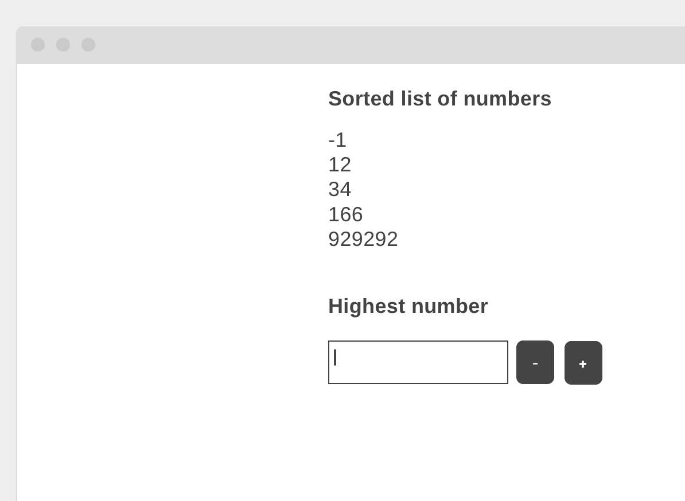

# Algorithm and Web Development Assessment

## Task Description:
1. Read a list of integers from the provided 'input.txt' file (one number per line)
2. Sort the list in ascending order
3. Create a simple web page that:
   - Processes the file and sorting logic on the backend using PHP
   - Displays the sorted list on a web page
   - Shows the highest number from the list in a form input
   - Implements functionality to increase or decrease this value by 5
   - Ensures the value cannot go below zero
   - Includes basic styling for readability

## Technical Requirements:
- Backend processing must be implemented in PHP
- Frontend can use HTML5 features and JavaScript if necessary
- The solution should be simple and efficient

## Getting Started

### Option 1: Using Docker (Recommended)
A Docker environment has been provided for your convenience.

1. Make sure you have Docker and Docker Compose installed on your system
2. Clone this repository
3. Navigate to the repository directory
4. Run `docker-compose up -d`
5. Access the application at http://localhost:8080

### Option 2: Local Setup
If you prefer not to use Docker:

1. Set up a local PHP environment (XAMPP, WAMP, MAMP, etc.)
2. Clone this repository to your web server's document root
3. Access the application via your local web server

### Wireframe



### Project Structure
```
.
├── docker-compose.yml         # Docker configuration
├── data/                      # Data directory
│   └── input.txt              # Input file with random numbers
├── src/                       # Source code directory
│   ├── index.php              # Main entry point
│   └── css/                   # CSS files (if needed)
└── README.md                  # This file
```

## Submission:
- Create a git (Github/Gitlab) repository with your solution
- Include a README.md explaining how to run your code and any design decisions
- Ensure your code is well-commented and follows best practices

## Evaluation Criteria:
- Correctness of the algorithm implementation
- Understanding of time/space complexity
- Proper use of PHP for backend processing
- Efficient implementation of the increment/decrement functionality
- Code organization and readability
- Error handling